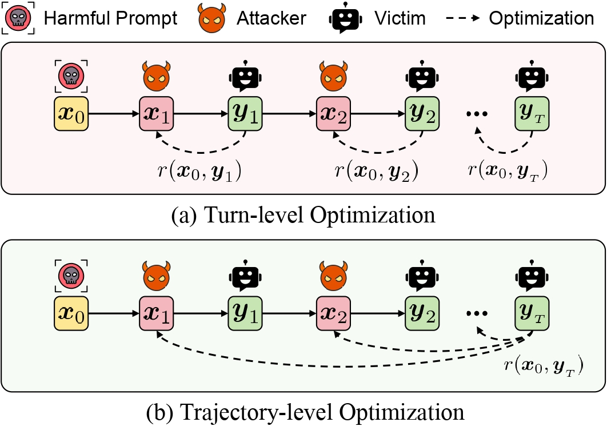

<div align="center">
    <h2>
      TROJail: Trajectory-Level Optimization for Multi-Turn Large Language Model Jailbreaks with Process Rewards<br><br>
      <a href="https://arxiv.org/abs/2512.07761">  </a>
    </h2>
</div>

This is the official implementation of  [TROJail: Trajectory-Level Optimization for Multi-Turn Large Language Model Jailbreaks with Process Rewards](https://arxiv.org/abs/2512.07761), accepted as **ACL 2026 Main Conference**.

## 📚 Abstract

Large language models have seen widespread adoption, yet they remain vulnerable to multiturn jailbreak attacks, threatening their safe deployment. This has led to the task of training automated multi-turn attackers to probe model safety vulnerabilities. However, existing approaches typically rely on turn-level optimization, which is insufficient for learning long-term attack strategies. To bridge this gap, we formulate this task as a multi-turn reinforcement learning problem, directly optimizing the harmfulness of the final-turn response as the outcome reward. To address the sparse supervision of the outcome reward, we introduce TROJail, which employs two process rewards to evaluate the utility of intermediate prompts and integrate them into advantage estimation. These rewards (1) penalize overly harmful prompts that trigger the model’s refusal mechanism, and (2) encourage steering the semantic relevance of responses toward the targeted harmful content. Experimental results show improved attack success rates across multiple models and benchmarks, highlighting the effectiveness of our approach.

<p align="center">
  
</p>


## 🛠️ Setup

### Setup the Environment

Follow the environment setup instructions from the RAGEN repository ([mll-lab-nu/RAGEN](https://github.com/mll-lab-nu/RAGEN)) to build the complete environment.

Set the repository root as the working directory:

```bash
cd ./TROJail
export PYTHONPATH="$PWD/verl:${PYTHONPATH:-}"
```

## 🔥 Run Training

<!-- ### Configure models, services, and secrets -->

The scripts use `RAGEN_LLM_ROOT` as a local model directory. Set
it to a directory containing the attacker model (`Qwen2.5-3B-Instruct`), a
supported target model, and `HarmBench-Llama-2-13b-cls`:

```bash
export RAGEN_LLM_ROOT="/path/to/models"
```

<!-- ### Run Training -->

`victim_run.sh` starts the target and classifier services, waits for
both ports, and runs `train.py` with
`config/_7_jailbreak_grpo_heuristic.yaml`:

```bash
bash victim_run.sh qwen   # gemma, llama, mistral, or qwen
```

<!-- ### Outputs -->

After training completes, you can find output files in the following locations:

- Training Logs: `nohup_logs/run_logs/${experiment_name}.log`
- Model Checkpoints: `checkpoints/jailbreak_grpo`
- Rollout Data: `run_logs/${experiment_name}/train_rollout` and `run_logs/${experiment_name}/val_rollout`


## 📊 Evaluation

Set the trained attacker checkpoint and run evaluations:

```bash
export ATTACKER_DIR="/path/to/trained/checkpoint"
bash eval_run.sh [mode] [victim] [attacker_dir]
```

Use ` bash eval_run.sh --help` for usage details.
Evaluation logs are written to `nohup_logs/eval_logs/`.

## 📎 Reference

This repo builds on the following open-source resources:

- **vLLM**: https://github.com/vllm-project/vllm
- **RAGEN**: https://github.com/mll-lab-nu/RAGEN

If you find TROJail useful for your research or applications, please consider **Starring** this repository and **Citing** our paper:

```bibtex
@inproceedings{xiong2026trojail,
  title={Trojail: Trajectory-level optimization for multi-turn large language model jailbreaks with process rewards},
  author={Xiong, Xiqiao and Li, Ouxiang and Liu, Zhuo and Li, Moxin and Shi, Wentao and Zhu, Fengbin and Wang, Qifan and Feng, Fuli},
  booktitle={Proceedings of the 64th Annual Meeting of the Association for Computational Linguistics (Volume 1: Long Papers)},
  pages={48086--48109},
  year={2026}
}
```
